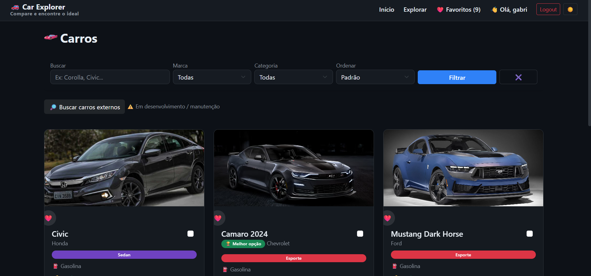
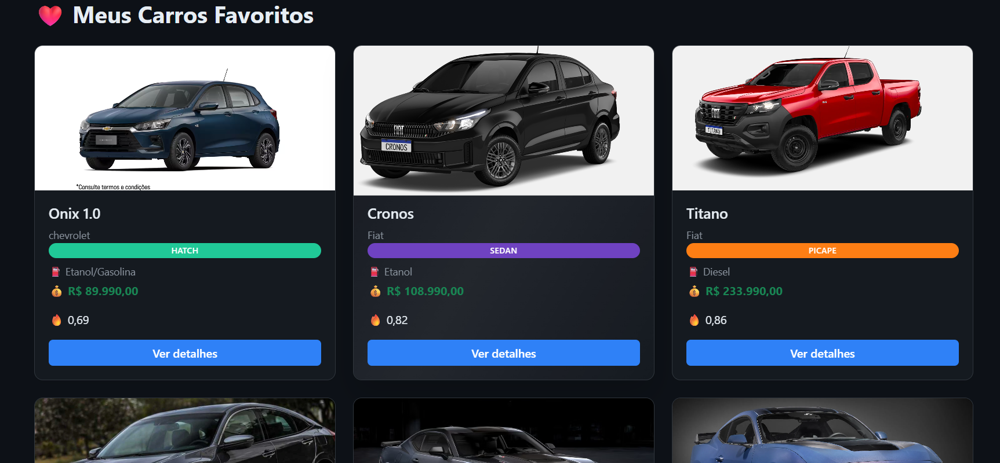
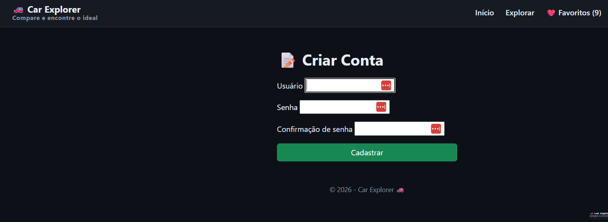

# 🚗 Car Explorer

Aplicação web feita com Django para explorar, comparar e favoritar carros.

## ✨ Funcionalidades

- 🔎 Filtro de carros por nome, marca e categoria
- 📊 Comparação entre múltiplos carros
- ❤️ Sistema de favoritos (com login)
- 🌙 Modo escuro
- ⚡ Integração com API externa (em desenvolvimento)
- 📱 Interface responsiva

---

## 📸 Screenshots

### 🔎 Lista de Carros


### ❤️ Favoritos


### 🧾 Cadastro de Usuário


---

## 🛠️ Tecnologias

- Python
- Django
- HTML / CSS / JavaScript
- Bootstrap

---

## 🚀 Como rodar o projeto

```bash
# Clonar o repositório
git clone https://github.com/gabrielbastosg/Projeto-Carro.git

# Entrar na pasta
cd seu-repo

# Criar ambiente virtual
python -m venv venv

# Ativar ambiente
venv\Scripts\activate  # Windows

# Instalar dependências
pip install -r requirements.txt

# Rodar servidor
python manage.py runserver

---

📌 Status

🚧 Em desenvolvimento
(API externa ainda limitada)

👨‍💻 Autor

Gabriel Bastos
